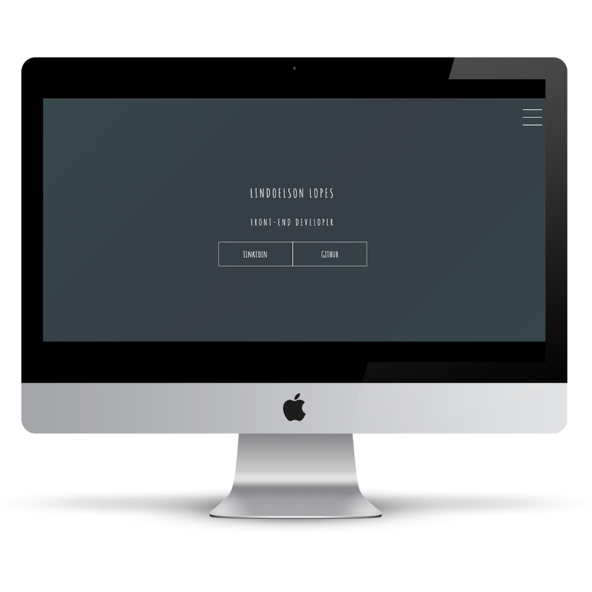
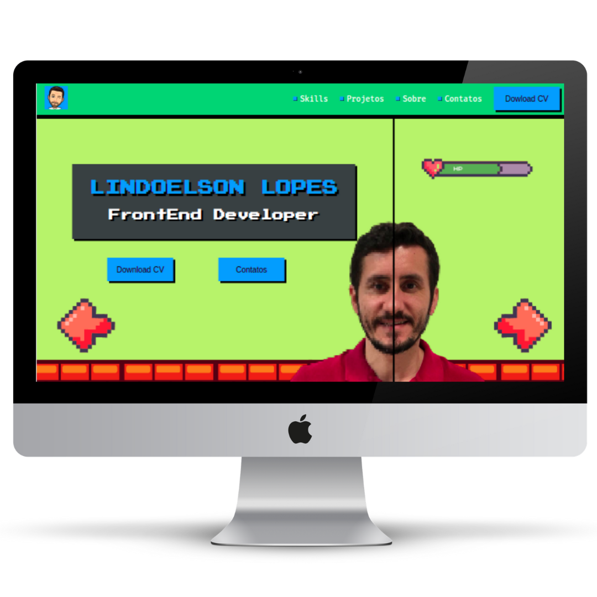

## Olá! Eu sou o Lindoelson Lopes 👋

Desenvolvedor Web Full Stack em formação pela<a href="https://www.betrybe.com/" target="_blank"> Trybe.</a> Tenho 41 anos, pais de dois filhos, brasileiro e moro em São Paulo Capital.  Depois de 2 anos empreendendo me apaixonei pela tecnologia e percebi que posso fazer a diferença como desenvolvedor. Sou uma pessoa dedicada, focada, curiosa e amo buscar soluções.

  <a href="https://github.com/lindoelsonLopes">
  
      
  

  

 
  
  
    
  
  
  
  
  
  

<h1 align="center">Meus Projetos</h1>
<table>
  <tr>
    <td valign="top" width="50%">
    <h2 align="center"><a href="https://lindoelsonlopes.github.io/ProjetoDioPortfolio/" target="_blank">Projeto modelo de Portfolio</a></h2>
    
     
     
    
Projetos:

    
Em breve

    </td>
    <td valign="top" width="50%">
    <h2 align="center"><a href="https://github.com/lindoelsonLopes/PortfolioOficial" target="_blank">Portfolio Oficial</a></h2>
    
     
     
    
Projeto elaborado com HTML5 e CSS3 

    
Portfolio inspirado no Curso do <a href="https://www.youtube.com/c/MarcoBrunoDev" target="_blank">Marco Bruno </a>onde realizei mudanças para ficar mais condizente com o meu perfil. Em breve será importado todos os projetos que mais me orgulho.

    
Também trabalharei em breve na responsividade do portfolio.

    </td>
  </tr>
</table>
